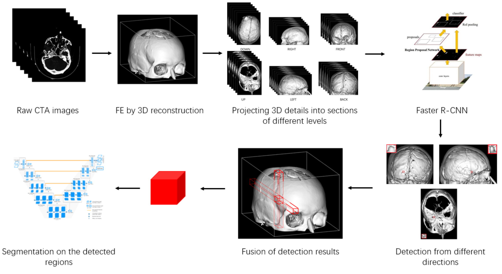

Enriching computed tomography images by projection for robust automated cerebral aneurysm detection and segmentation.
==========
Cerebral aneurysm is a kind of very dangerous disease and it is very important for patients to find and treat cerebral aneurysms in time. Thus, developing an efficient system for automated detection and segmentation of intracranial aneurysms (IAs) became an active research topic recently.   
In this study, we present a feature enrichment (FE) based deep learning method for robust IA detection and segmentation. The FE technique is featured by reconstructing a 3D model from all computed tomography angiography (CTA) images and then projecting 3D information into the so-called projection images of different slicing levels along various directions. The appearances of aneurysms in the projection images are enhanced in morphology and 3D neighborhood features, and thus are easy to be detected and segmented by the widely-used Faster RCNN and V-Net. Experiments on our dataset indicate that our method achieves the state-of-the-art methods.  




Date preparing
-------------
Our dataset was collect from hospital.  It is DICOM file. Those data was saved in ./data/DICOM.
First we need transfor dicom to nii_file.
```
cd data_prepare.py
python dicom_2_nii.py
```
nii_files were saved in ./data/nii_file. 

if you want remove skull, refer https://github.com/WuChanada/StripSkullCT

brain_file were saved in ./data/brain_file.
For better performance, you can remove some disturbing matter.

```
python better_dfs.py
```
Then, the better data was saved in ./data/img_source_data.

For detection, we need reconstruct the brain and slice the reconstructed brain. The sliced image was saved in ./data/imgdata.
The process of reconstruction and slicing need in Windows, and you need config VTK environment, please refering ./Sliceing/config_VTK.doc 
```
python to_mhd.py
slicing.cpp
prepocess_img.py
slice_img_to_nine.py
```

For detection training, we need find some image contained aneurysms from sliced image and annotate them.  
you can refer this link https://blog.csdn.net/zcy0xy/article/details/79614862 to set training data.   
For detection testing, the sliced images in test dataset are our testing dataset.


For Segmentation, the training data was sliced from raw data and saved in ./Segmentation/train_data. The size of those data was 64x64x64 and aneurysms were included those training data.

```
cd Segmentation
python produce_train_data.py
```

Training
-----------
Our training model is Faster-RCNN, if you have any question, you can refer https://github.com/ruotianluo/pytorch-faster-rcnn.    
```
cd Detection
./experiment/script/train_faster_rcnn.sh GPU_NUM pascal_voc res101
```
GPU_NUM is the number of GUP, like 0 or 1.  
After training, the detection model was save in ./Detection/output//res101/voc_2007_trainval/default/.  
We use this model to detect aneurysms.

Detection
--------------
```
cd Detection
python tool/detect_aneurysm.py
```
After detection, a txt file was saved in ./.   
This file contains the information of aneurysms location from different directions.  

Fusion
-----------------
We need fusion location information from different directions. 
```
python slice_cube.py
```
After fusion, cubes contains aneurysm were saved in ./data/sliced_data/  

Train segmentation model
---------------
```
cd Segmentation
python train.py
```

Segment aneurysm
--------------
```
cd Segmentation
python segment_aneurysm.py
```
The segment result was saved in ./data/result_data/


Trained model path
-----------

Trained models were saved in   
2227/cmach-data/marui/BIBM/Detection/data/imagenet_weights/res101.pth     
2227/cmach-data/marui/BIBM/Detection/output/res101/voc_2007_trainval/default/res101_faster_rcnn_iter_80000.pth          
2227/cmach-data/marui/BIBM/Segmentation/ckpts/model_epoch_500.pth  
